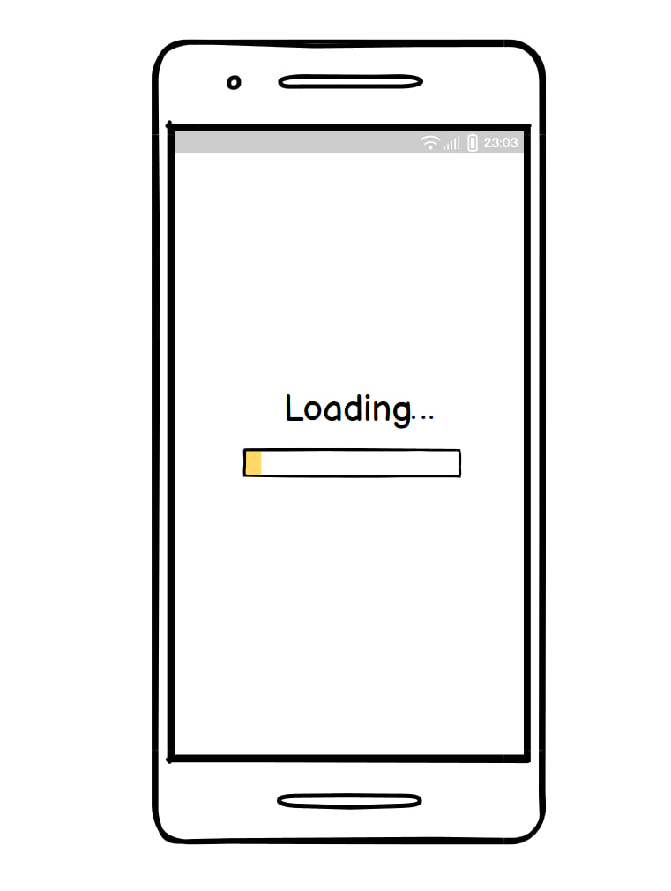
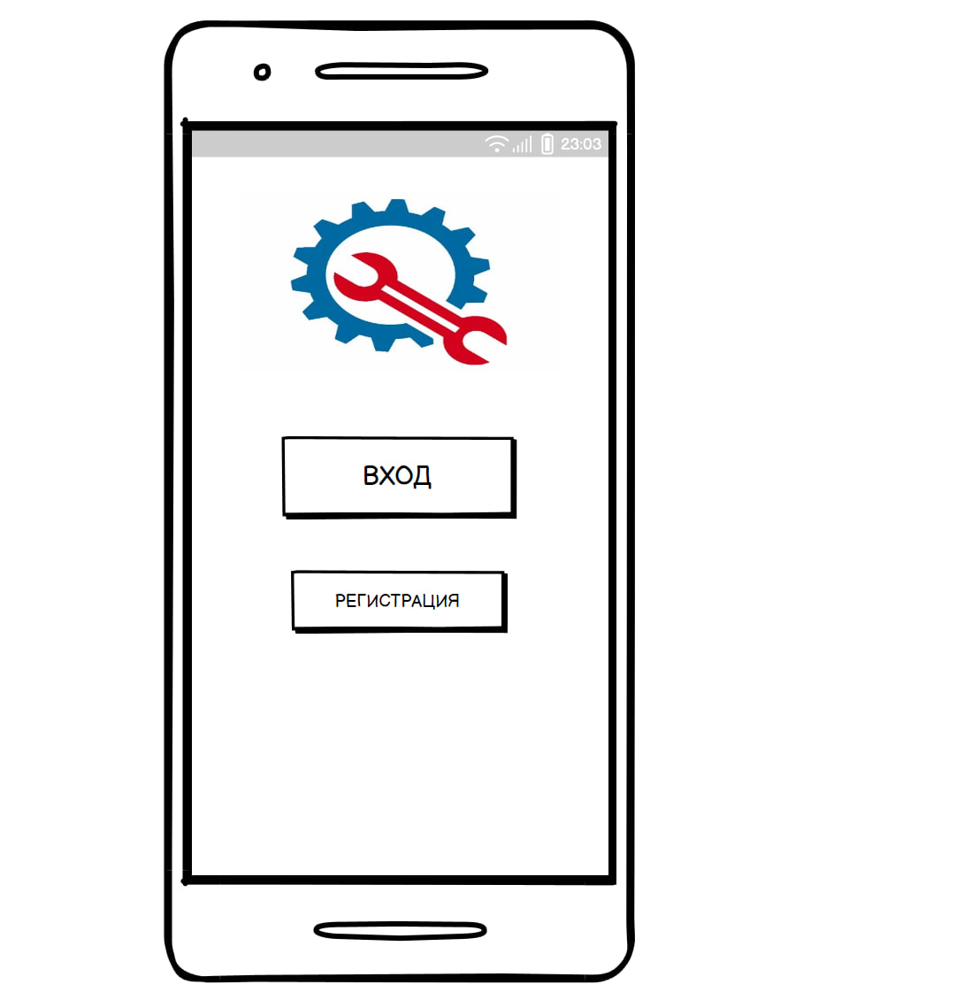
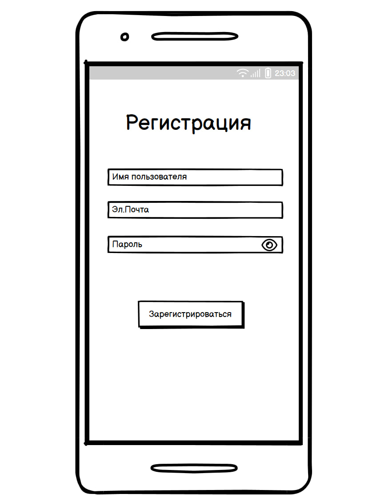
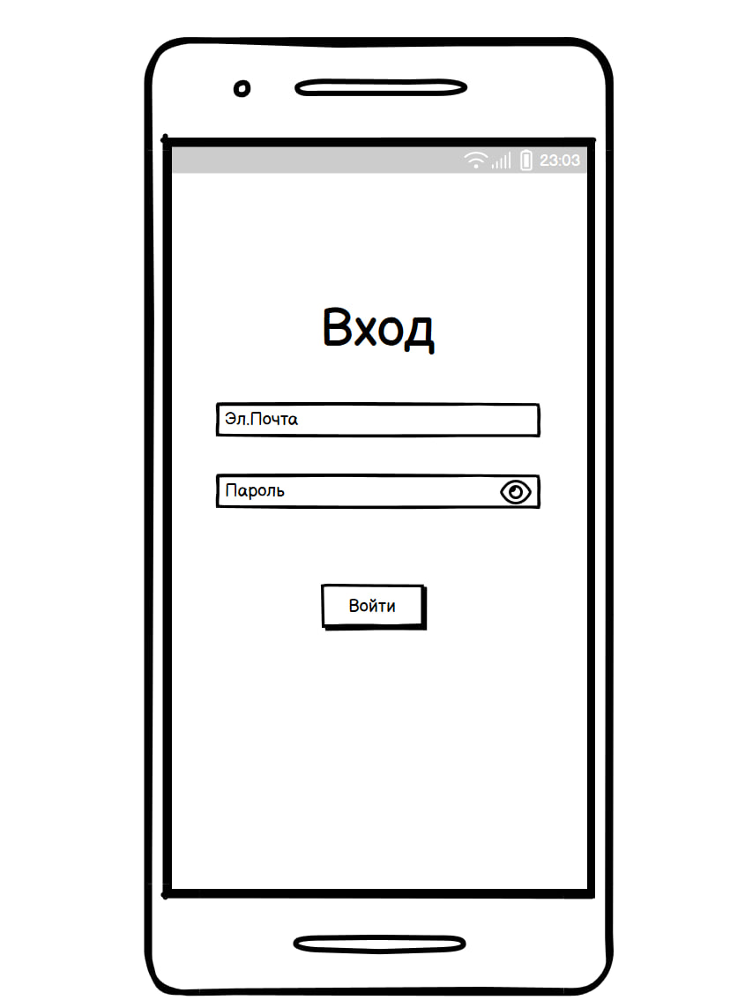
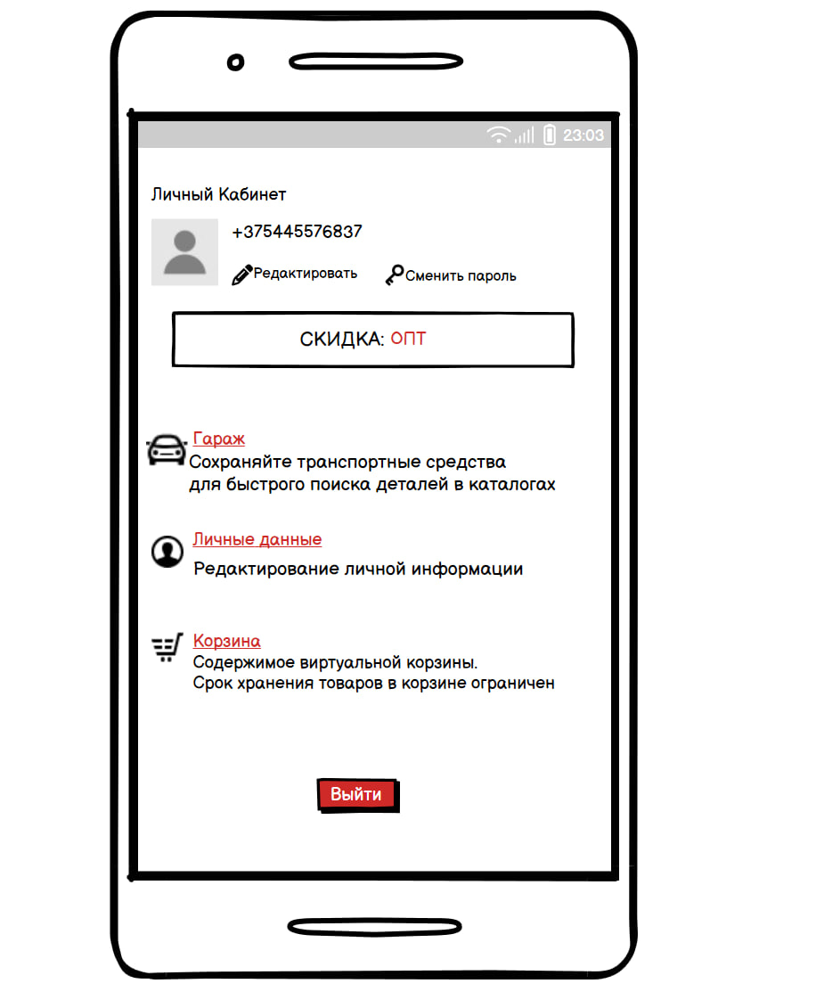
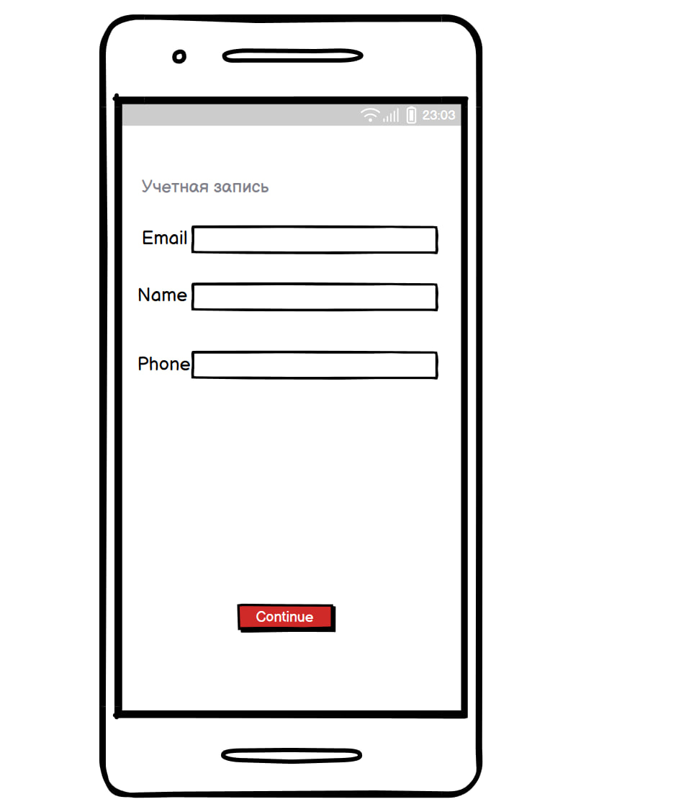
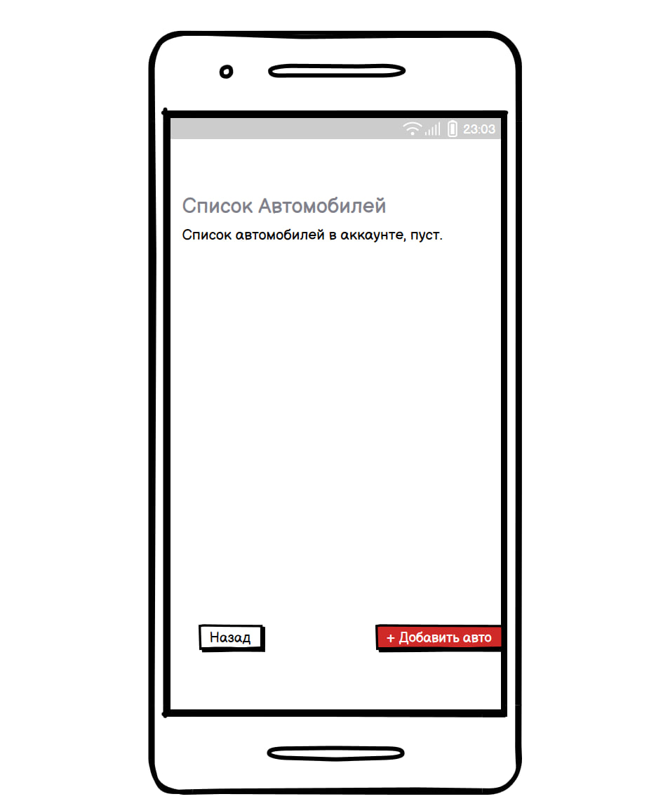
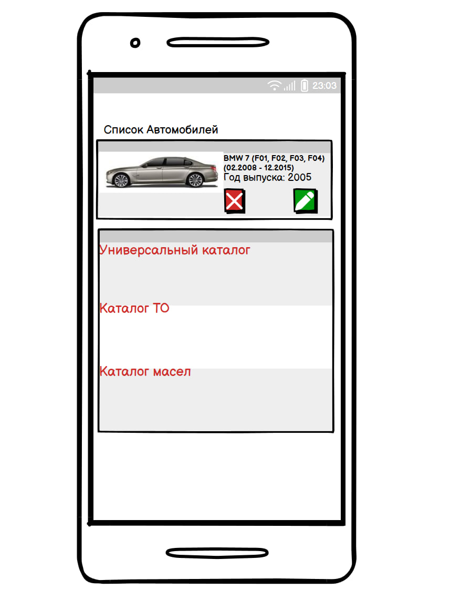
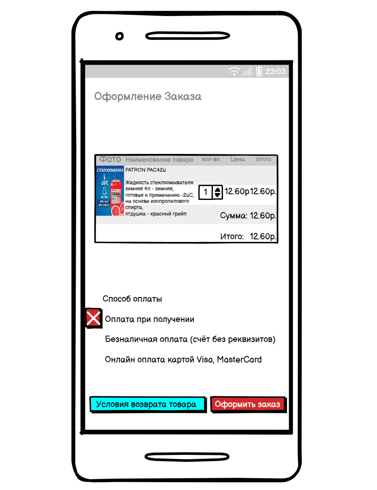

# Zapchacti.ru_Application
---

## <a id="table_of_contents">Оглавление</a>
- [1. Введение](#introduction)
- [2. Требования пользователя](#user_requirements)
    - [2.1 Программные интерфейсы](#software_interfaces)
    - [2.2 Интерфейс пользователя](#user_interfaces)
    - [2.3 Характеристики пользователей](#user_characteristic)
    - [2.4 Предположения и зависимости](#assumotion_and_dependencies)
- [3. Системные требования](#system_requirements)
    - [3.1 Функциональные требования](#functional_req)
    - [3.2 Нефункциональные требования](#nonfunctional_req)
    
## <a id="introduction">1. Введение</a>

#### __Название проекта:__ _Zapchacti.ru_

#### __Технологии и инструменты разработки:__
- Язык разработки: _Kotlin_
- Фреймворк для создания: _XML_
- Среда разработки: _Android studio_

#### **Описание проекта:**
Проект представляет собой мобильное приложение для  продажи автозапчастей. Пользователи могут сохранять транспортные средства для быстрого поиска деталей в каталогах и покупать детали.

#### **Границы проекта**
Приложение не прдоставляет фунцкции поиска автозапчастей из других источников.

## <a id="user_requirements">2. Требования пользователя</a>

### <a id="software_interfaces">2.1 Программные интерфейсы</a>

Продукт будет взаимодействовать с несколькими внешними системами:
- __Firebase Authentication__ для хранения и авторизации пользователей
- __Transaction database__ локального хранения о различных автозапчастей

### <a id="user_interfaces">2.2 Интерфейс пользователя</a>

Приложение будет содержать следующие основные интерфейсы:

- Окно загрузки приложение

- Стартовое окно при входе в приложение

- Окно регистрации нового пользователя

- Окно входа для зарегистрированного пользователя

- Окно главного меню

- Окно для управления личной информации пользователя

- Окно для добавления автомобиля с последующим побдором автозапчастей

- После добавления автомобиля основная информация изображается в гараже

- Окно для просмотра виртуальной корзины

### <a id="user_characteristic">2.3 Характеристики пользователей</a>

#### Классы пользователей

<table>
    <tr>
        <th>Класс пользователей </th>
        <th>Описание </th>
    </tr>
    <tr>
        <td>Посетители </td>
        <td> Пользователи, которые не хотят регистрироваться в приложение. Имеют доступ к частичному  функционалу. </td>
    </tr>
    <tr>
        <td>Зарегистрированные Пользователи</td>
        <td>Пользователи, которые вошли в приложение под своим именем, желающие просматривать информацию о запчастях к своей выбранной машине, отобранных согласно их предпочтениям, а так же в случчае при входе в другое устройство сохраняют свои данные</td>
    </tr>
</table>

### <a id="assumotion_and_dependencies">2.4 Предположения и зависимости</a>

- Приложение будет работать только на устройствах с Android 6.0 и выше
- Для добавления нужных запчастей к своей машине необходимо подключение к интернету

## <a id="system_requirements">3. Системные требования</a>

### <a id="functional_req">3.1 Функциональные требования</a>

- Приложение должно позволять пользователям добавлять, редактировать, просматривать запчасти.

- Приложение должно правильно и интуитивно распредять запчасти по выбранной машине.

- Авторизация должна быть необязательна, она необходима для сохранности личных данных пользователей.

- Приложение должно поддерживать синхронизацию данных с облаком (Firebase).

### <a id="nonfunctional_req">3.2 Нефункциональные требования</a>

- Надёжность: Приложение должно быть устойчивым к потерям соединения с интернетом, с возможностью локального хранения данных и последующей синхронизации.

-  Безопасность: Данные пользователей должны быть защищены, а авторизация — проводиться через надёжную систему (например, Firebase Authentication). 

- Производительность: Приложение должно загружаться и работать плавно на большинстве современных устройств.

- Удобство использования: Интерфейс должен быть интуитивно понятным, особенно для пользователей с базовыми техническими навыками.

